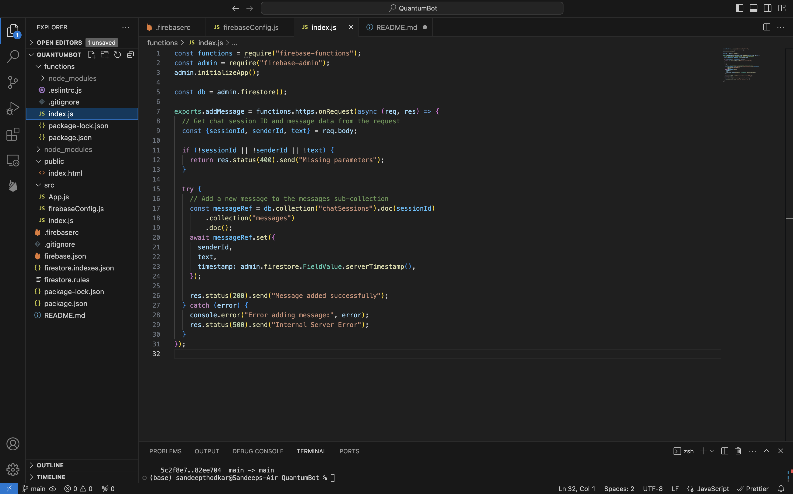
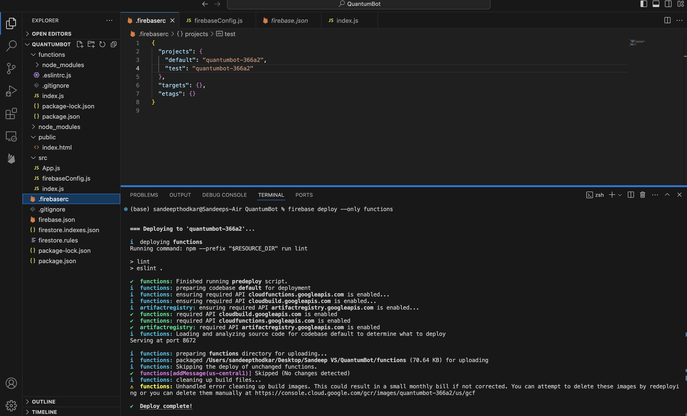
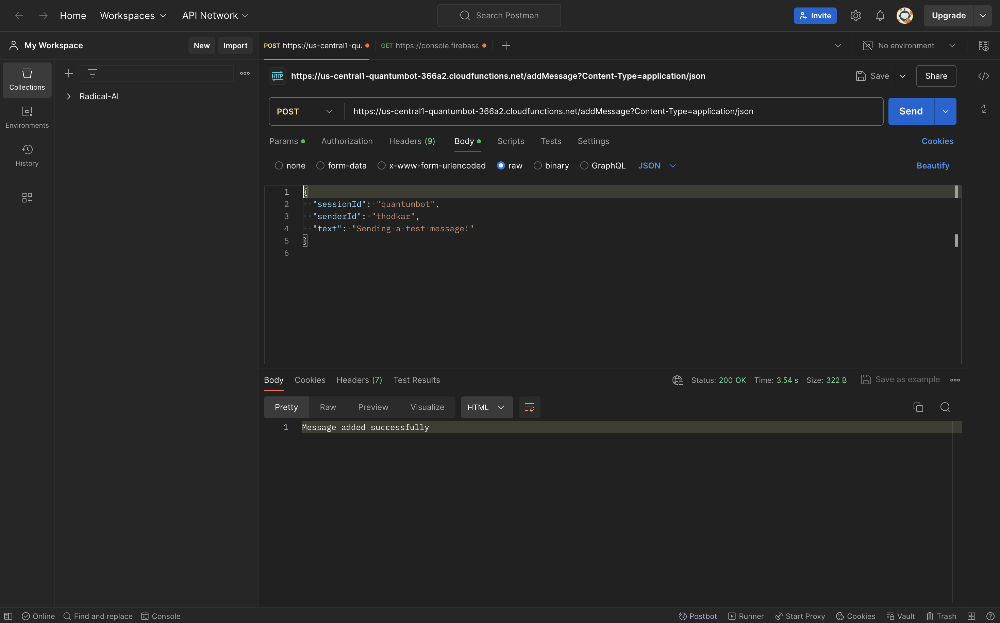
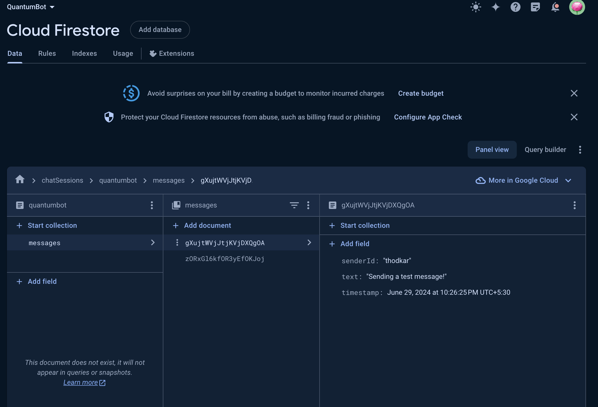

# QuantumBot

QuantumBot is a project aimed at building backend services to support real-time interactions, enhancing communication and collaboration. The project leverages technologies like Node.js, Firebase CLI, and Firebase Firestore for data storage and management. Key features include setting up Firebase Functions to handle real-time messaging, utilizing Postman for API testing, and integrating Firebase Authentication for user management and security. The project is hosted on GitHub for version control and collaboration, ensuring seamless development and deployment processes.

Screenshots:

